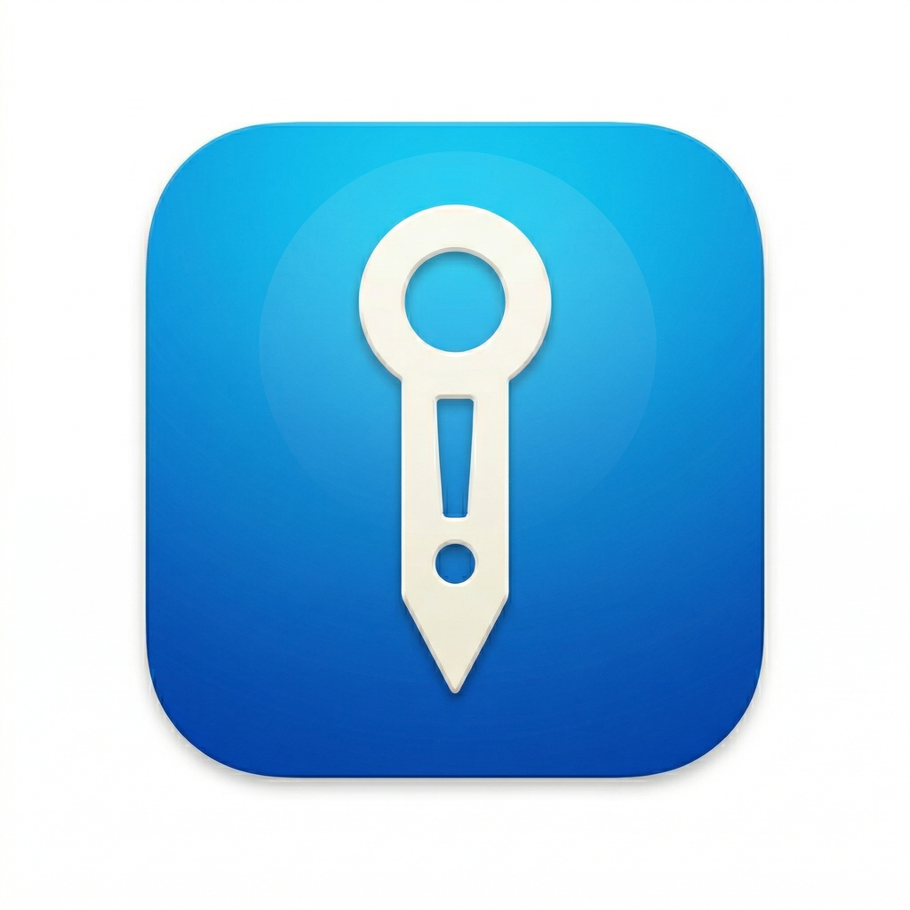

# Pinpoint (P!nPo!nt)

Pinpoint is a lightweight macOS utility that helps you find your mouse cursor by highlighting it with a "spotlight" effect. 



## Features

- **Quick Highlight**: Instantly find your cursor by tapping a modifier key (e.g., Left Control) multiple times.
- **Customizable**:
  - Choose modifier keys (Control, Option, Command, Shift).
  - Set tap count (3, 4, or 5).
  - Adjust spotlight size and animation style.
- **Multi-monitor Support**: Works across all connected displays.
- **Autostart**: Option to launch at login.

## Usage

1. Launch Pinpoint.
2. Tap the **Left Control** key (default) 3 times rapidly.
3. The screen will dim except for a spotlight around your cursor.
4. Move the mouse or press any key/click to dismiss the highlight.

## Installation

### Download Pre-built Binary

1. Go to the [Releases](https://github.com/setomits/pinpoint/releases) page.
2. Download the latest `Pinpoint_vX.X.X.zip`.
3. Unzip and move `P!nPo!nt.app` to your `/Applications` folder.

> **Note:** Since this app is not signed with an Apple Developer ID that is trusted by Gatekeeper, macOS may prevent it from opening. To fix this:
> 1. Right-click (or Control-click) the app and select **Open**.
> 2. Click **Open** again in the dialog.
> 
> Alternatively, run this command in Terminal:
> ```bash
> xattr -cr /Applications/P!nPo!nt.app
> ```

### Prerequisites

- macOS 12.0 or later.
- Swift 5.5+ (for building from source).

### Building from Source

1. Clone the repository:
   ```bash
   git clone https://github.com/setomits/pinpoint.git
   cd pinpoint/app
   ```
2. Build the app:
   ```bash
   make
   ```
   > **Note:** By default, the app is built without a code signature. To maintain Accessibility permissions across builds, you can sign it with your own developer identity.
   > 
   > Create a `local.mk` file (based on `local.mk.example`) in the `app/` directory and set your identity:
   > ```makefile
   > SIGN_IDENTITY = Apple Development: Your Name (TEAMID)
   > ```

3. The app will be generated in `app/build/P!nPo!nt.app`. Move it to your `/Applications` folder.

## Troubleshooting

- **Accessibility Access**: Pinpoint requires Accessibility permission to detect modifier key taps globally. If the spotlight doesn't appear, ensure Pinpoint is enabled in *System Settings > Privacy & Security > Accessibility*.

## License

This project is licensed under the MIT License - see the [LICENSE](LICENSE) file for details.
